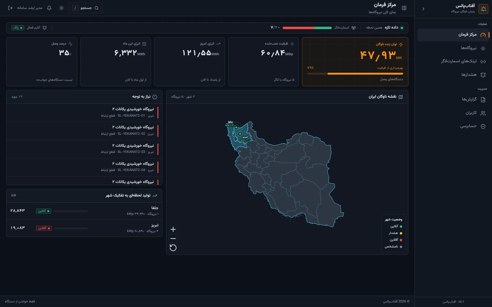
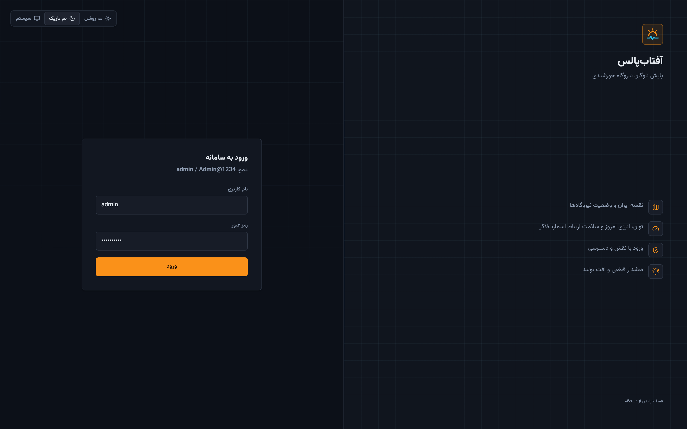
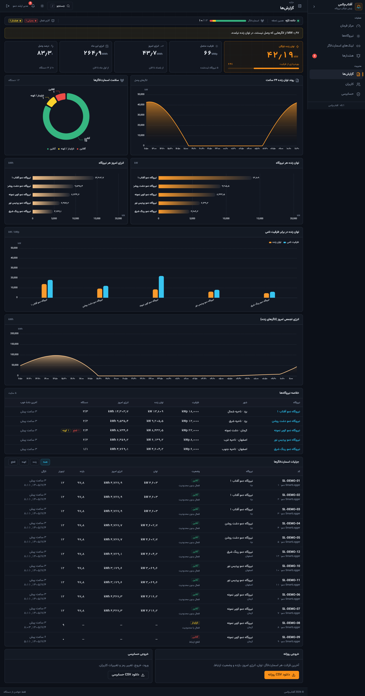
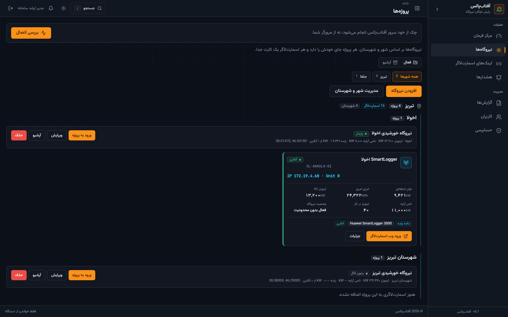
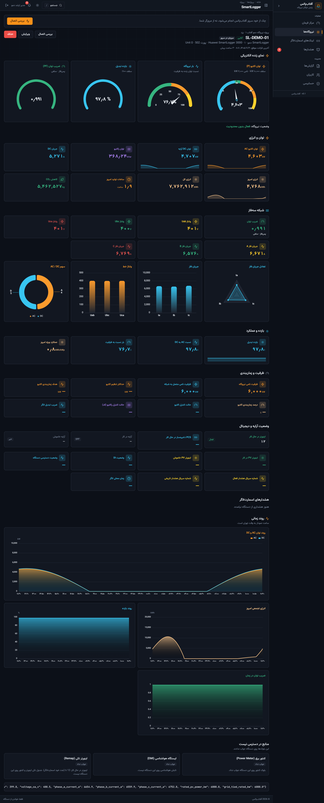
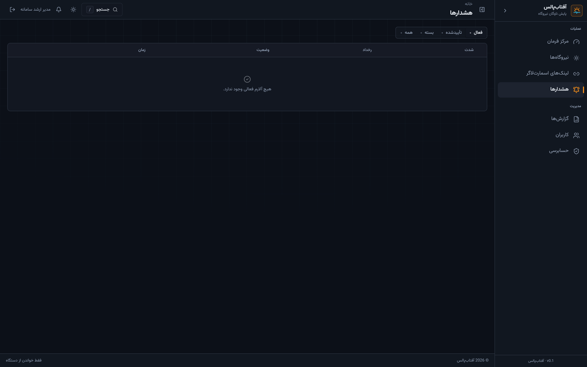

# AftabPulse

**Solar fleet monitoring · Huawei SmartLogger · Iran map** — public product catalog

  

  

<a href="https://ramincsy.github.io/solar-monitoring-showcase/"><b>https://ramincsy.github.io/solar-monitoring-showcase/</b></a>

  
  

> **Demo first:** the live product window is on **GitHub Pages** (full-page screens · click to zoom and scroll). This repo is a public catalog only — implementation stays private. Screenshots use a **fictional sample fleet** (no customer plants, orgs, or OT IPs).

---

## Live catalog (GitHub Pages)

| | |
|:--|:--|
| **Open demo** | [ramincsy.github.io/solar-monitoring-showcase](https://ramincsy.github.io/solar-monitoring-showcase/) |
| What you get | Numbered tour: sign-in → command → plants → HMI → reports → audit |
| Controls | Click any shot · ← → follows tour order · Esc |

---

## Preview

  

<b><a href="https://ramincsy.github.io/solar-monitoring-showcase/">Open the interactive catalog →</a></b>

| Sign-in | Command | Reports |
|:---:|:---:|:---:|
|  |  |  |

| Plants | Live HMI | Alerts |
|:---:|:---:|:---:|
|  |  |  |

---

## What AftabPulse is

On-prem Persian/RTL console for multi-site photovoltaic plants. It **reads** Huawei SmartLogger 3000 over Modbus (never writes), shows live megawatts on a national map, and keeps plant HMI, alerts, and reports in one operations UI.

The public catalog is a **demo dataset** (Yazd / Kerman / Isfahan sample sites) so customer names and device addresses never appear.

Surfaces in the live catalog: **01 Sign-in · 02 Command · 03 Map · 04 Plants · 05 Plant · 06 HMI · 07 Reports · 08 Alerts · 09 Portals · 10 Users · 11 Audit**

---

### فارسی

این مخزن فقط یک <b>کاتالوگ عمومی</b> از رابط آفتاب‌پالس است. برای دیدن دموی تعاملی (زوم، گالری و تور محصول) به GitHub Pages بروید:

<a href="https://ramincsy.github.io/solar-monitoring-showcase/"><b>مشاهده کاتالوگ زنده آفتاب‌پالس</b></a>

آفتاب‌پالس پایش ناوگان نیروگاه خورشیدی است (نقشه ایران، توان زنده، HMI اسمارت‌لاگر و گزارش). سورس و جزئیات پیاده‌سازی در این مخزن منتشر نمی‌شود.

---

**Contact:** [ramioo.com](https://www.ramioo.com) · [ramincsywork@gmail.com](mailto:ramincsywork@gmail.com) · [0914 666 50 68](tel:+989146665068)

© ramioo
